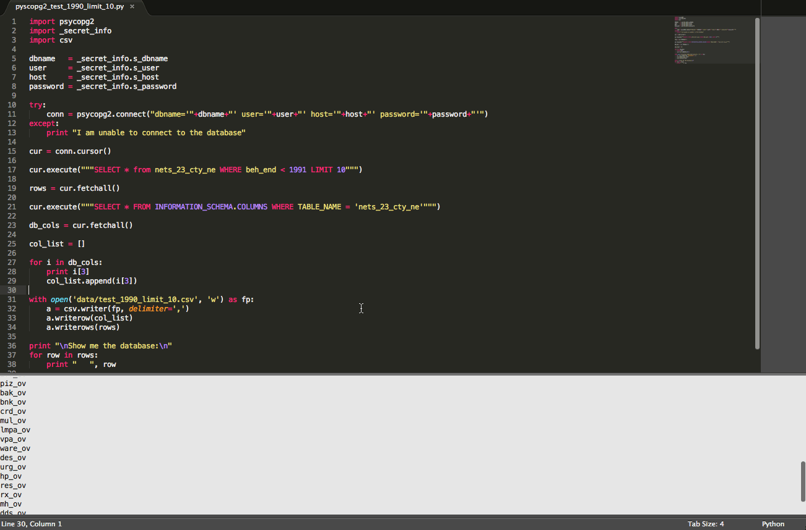

# NETS API for 25 year national dataset

## Getting data via simple SQL query

## Buffering and intersecting data via PostGIS SQL

Key funtion, that is the only think user would need to reference, could loop through lists of lat,lng's (rather than send all up at once and have a huge file returned - though some testing could determine if this is desirable). 

	getNetsFromLatLng('-74.0059 40.7127','0.01') 

## Protecting your _secret_info (database username and password) with .gitignore

###.gitignore
gitignore is a file you store in your repo, name the file **.gitignore**. Yes, with the **.** starting the file extension, with no file name.

	# Secret Python files #
	###################
	*_secret_info.py
	*.pyc
	

	
###\_secret_info.py 

Here's what your **\_secret_info.py** file should look like, if you choose to use it. 

	s_dbname   = 'nets'
	s_user     = <username>
	s_host     = <db host address>
	s_password = <password>
	
	
##To Do:
* port to R
* reference and create nets_api.py with functions in that file
* include reference modules